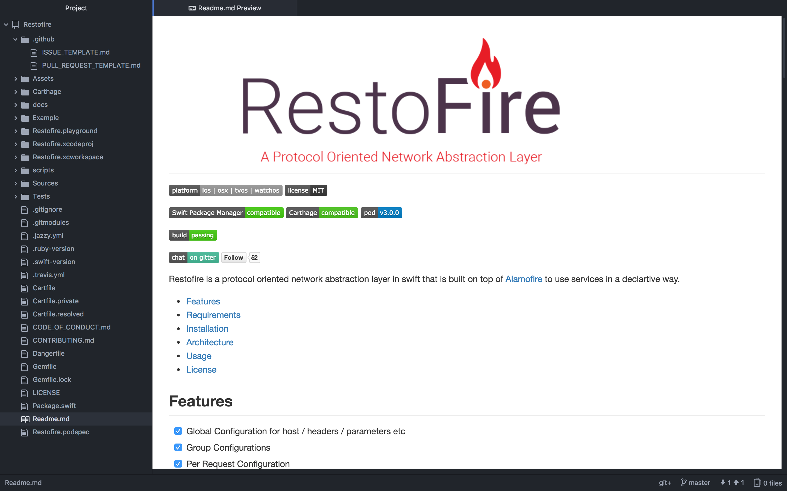

# Framework Template

A template for new Framework project.


[](https://raw.githubusercontent.com/JetpackSwift/FrameworkTemplate/master/LICENSE)

[](https://github.com/apple/swift-package-manager)
[](https://github.com/Carthage/Carthage)
[](https://github.com/CocoaPods/CocoaPods)

[](https://travis-ci.org/JetpackSwift/FrameworkTemplate/branches)

[](https://gitter.im/JetpackSwift/FrameworkTemplate?utm_source=badge&utm_medium=badge&utm_campaign=pr-badge&utm_content=badge)
[](https://twitter.com/rahulkatariya91)



## What's in the template?

- Deployment Targets - iOS 8.0 / Mac OS X 10.10 / tvOS 9.0 / watchOS 2.0
- Xcode 9.3
- Swift 4.1
- Dependency Managers - CocoaPods / Carthage / Swift Package Manager
- Readme
- Dangerfile / Gemfile / Jazzy
- Github Templates (CODE_OF_CONDUCT, CONTRIBUTING, ISSUE_TEMPLATE, PULL_REQUEST_TEMPLATE)
- TravisCI
- MIT LICENSE
- Testing Dependencies - Quick and Nimble

## Usage


1. [Install carthage][carthage] (`brew install carthage` on
   macOS).
2. [Install cookiecutter][cookiecutter] (`brew install cookiecutter` on
   macOS).
3. Run `cookiecutter https://github.com/RahulKatariya/FrameworkTemplate`

[carthage]: https://github.com/Carthage/Carthage
[cookiecutter]: http://cookiecutter.readthedocs.org/en/latest/installation.html

For future runs you can shorten the command to `cookiecutter FrameworkTemplate`.
However, if you want to use the most recent template you should still run the full command above.

## Additional instructions

This template attempts to provide you an easy setup of your framework repository with many third-party services, however some of them require additional steps such as register and authentication. Below you can find instructions in case this is the first time you set any of these:

<details>
  <summary><strong>CocoaPods</strong></summary>

If this is the first time submitting to CocoaPods a framework named like yours, you need to register your e-mail to CocoaPods system in order to receive owner access to it. You can do so using the following command:

```bash
$ pod trunk register your@email.com --description='My Mac'
```

Make sure to replace `your@email.com` by a valid email since the next step is to access a verification link that CocoaPods is going to send to that address.

The register process will install a token to your machine which can be read with the following command:

```bash
$ grep -A2 'trunk.cocoapods.org' ~/.netrc
machine trunk.cocoapods.org
  login your@email.com
  password ef9bb4c41a4459ba92645a85b3c9cd88
```

If you're using this template, the CocoaPods deploy commands are already in your `.travis.yml` file, so all you need now is to make sure the Travis CI machines are able to use that token. In order to do it securely, we recommend to do it by setting an environment variable and not allowing its value to be displayed in build logs.

In your repository build settings on Travis, add an environment variable named `COCOAPODS_TRUNK_TOKEN` with value `ef9bb4c41a4459ba92645a85b3c9cd88` - replacing this value by the password you've obtained from `~/.netrc`

References:

- [Automated CocoaPod releases with CI](https://fuller.li/posts/automated-cocoapods-releases-with-ci/)
- [Publishing to CocoaPods from Travis](https://stackoverflow.com/questions/26382002/publishing-to-cocoapods-from-travis)

</details>

<details>
  <summary><strong>GitHub releases</strong></summary>

In order to have the Travis CI submitting archives to the Releases tab in your framework's GitHub page, you need to adjust `.travis.yml` with your personal access token.

An easy way to obtain this token is by using the `travis` gem. You can install it and obtain a token with the following command, which will prompt you with a few questions and automatically modify your `.travis.yml` file:

```bash
$ gem install travis && travis setup releases
Detected repository as <your github username>/<your repository name>, is this correct? |yes|
Username: <your github username>
Password for <your github username>: ************
File to Upload: <the file name you want to upload>
Deploy only from <your github username>/<your repository name>? |yes|
Encrypt API key? |yes|
```

If you're using this template, part of these questions are not necessary for you, and the changes to `.travis.yml` will be mostly unhelpful, however among the changes you'll find this:
```bash
          api_key:
            secure: qtPP9xa5uU4F0TJFeYjRWISv0fdPMj6xe9TXQ/CyTXJIYwLVAZ8O1aawrE7yLY0lfKXOwV7hmgMs7sS39LudoQ6ElbT6n1tKzTNaoBRc7X2GkbZiLlXSuX+plwhvMU46evkSwNIJz1g4b5CxNdUCy4Or4eXqxyhhjv4Y4kC+TxmBC5kyrDBL6oHStiIB+VEPVjPMkml0nzb6KposkSXHTEffSyDNT4+vo+bv5QFBzUYW0l42shUmr+/biHDF6eIJjW8RePEgl0ydVhcWYedEMCulfmWgVPsJu+IkZ86M0ZPIfzlhQosMboWjcWZGv559MV6L4+cGl9ZCy4ro+Mj903yUqlm8RHELsgr/T1IpsZ2CyATWdshfnTcfEv8YgZdoNfm0qJ+77HIjPPGrFlbCfQDOlTncQWMiLAps8+iM0ijUL3mR1F79OHP+nAjdnVA+Adux/FkBRy48KJE87jNk9C6vEjP25HmXWfhI3YEBexu7Ys6W+EZeg4z/10rXFIJLMFaJJbWN/LwUmmTPpX7qIU3Rv0v+zDVwl4YvpM6UewGUuC+Db/vKSHr6o+E4n1BfolJYclFhkdzFaDockG4ijMgDLw8q4DLnF0e+eIMflLkLHKiDDNGvQWqm9UDZowQdlhhY1ig1BC+2LNzd1A/9IcRYz/oV5eHxgq3wwHT4cME=
```

Using this template, you can revert all changes created by `travis`, but save the generated base64 512 bytes secure key from the previous step before doing so, and add it to your `.travis.yml` at the corresponding spot.

References:

- [Adding GitHub token to Travis CI configuration](http://blog.code4hire.com/2016/06/Adding-GitHub-token-to-Travis-CI-configuration/)
- [How to use encrypted api keys for github release deployment](https://github.com/travis-ci/travis-ci/issues/2457)

</details>

## Built With FrameworkTemplate

- [Restofire](http://github.com/Restofire/Restofire)
- [RxCoreLocation](http://github.com/RxSwiftCommunity/RxCoreLocation)
- [RxCocoaNetworking](http://github.com/gobetti/RxCocoaNetworking)

## Credits

*Some of the ideas and wording for the statements above were based on work by the [Alamofire](https://github.com/Alamofire/Alamofire) and [ReactiveCocoa](https://github.com/ReactiveCocoa/ReactiveCocoa) communities. We commend them for their efforts.*

## Contributing

Issues and pull requests are welcome!

## Author

Rahul Katariya [@rahulkatariya91](https://twitter.com/rahulkatariya91)

## License

FrameworkTemplate is released under the MIT license. See [LICENSE](https://github.com/RahulKatariya/FrameworkTemplate/blob/master/LICENSE) for details.
